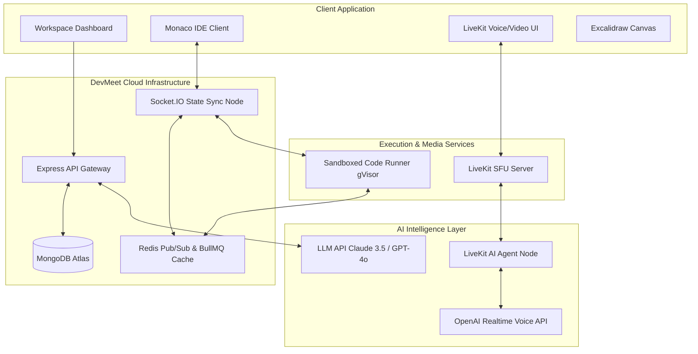
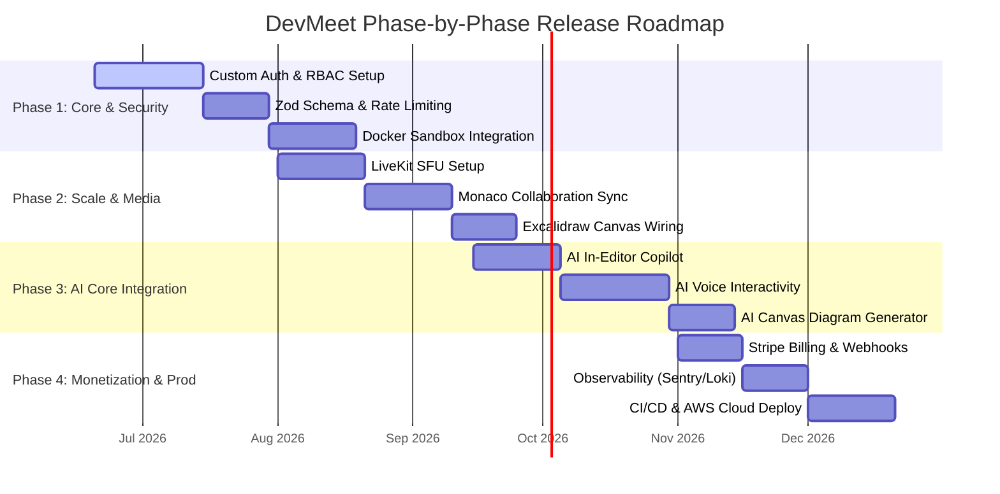

# Product Requirement Document (PRD): DevMeet
**Version:** 1.0.0  
**Author:** Product Engineering Group  
**Status:** Approved for Implementation  
**Target Release:** Q4 2026  

---

## 1. Executive Summary & Vision

### 1.1 Problem Statement
Modern software engineering teams, interviewers, and educators face a highly fragmented workflow. High-fidelity remote collaboration requires multiple disconnected tools:
* **Video/Audio Calling:** Zoom, Google Meet, or Slack.
* **Code Collaboration:** VS Code Live Share (requires IDE setup) or basic paste-bins.
* **Interviews:** CoderPad, HackerRank, or Byteboard (which feel transactional and lack natural collaborative environments).
* **Architecture Design:** Excalidraw, tldraw, or Miro.
* **AI Assistance:** Cursor, Copilot, or ChatGPT in a separate browser tab.

This fragmentation leads to high cognitive load, context-switching overhead, security vulnerability leakage (e.g., paste-binning internal code), and poor candidate experiences during interviews.

### 1.2 Product Vision
**DevMeet** is a unified, web-native, collaborative developer workspace. It merges real-time video/audio (built on LiveKit SFU), a multi-file Monaco IDE with secure sandboxed code execution, an interactive whiteboard (Excalidraw), and a resident, voice-enabled AI Agent (acting as a pair programmer or technical interviewer). 

DevMeet is designed to be:
* **Web-First:** Zero installs. Open a link and start coding, talking, and whiteboarding instantly.
* **Secure by Default:** Code execution is sandboxed under strict kernel-level isolation (gVisor/Firecracker) with strict resource caps.
* **Agent-Native:** The AI is not just a sidebar chat; it is an active room participant that can speak, listen, write code, and assess candidate workflows.



---

## 2. Market Analysis & Competitive Landscape

To capture market share, DevMeet targets key gaps in the collaborative programming and technical evaluation space.

| Competitor | Focus Area | Strengths | Weaknesses | DevMeet Competitive Edge |
| :--- | :--- | :--- | :--- | :--- |
| **CoderPad** | Tech Interviews | Good sandbox, stable runtime, candidate tracking. | High pricing, rigid UI, no native system diagramming, limited pair-programming features. | Integrated system diagramming, native AI voice interviewer, premium collaborative IDE workspace. |
| **Zoom / Meet** | General Video | High stability, scale, universal adoption. | Terrible code-sharing capabilities, text-only chat, no code runner, high latency screenshare. | Code-first design, built-in Monaco IDE, low-latency audio/video alongside active workspace. |
| **VS Code Live Share** | Team Collab | Heavy editor integration, extension support. | Complex setup, requires local application installation, fragile connection issues. | Zero-install web browser experience, persistent room environment. |
| **Tuple** | Pair Programming | Ultra-low latency, keyboard/mouse sharing. | Desktop app only (macOS/Linux priority), expensive, lacks built-in whiteboard or AI. | Multi-platform web compatibility, sandboxed execution, system whiteboarding, integrated AI. |

---

## 3. User Personas & Core Use Cases

### 3.1 Tech Interviewer (HR / Tech Lead)
* **Goal:** Evaluate a candidate's coding proficiency, system design capability, and communication skills in a secure, interactive, high-fidelity environment.
* **Pain Points:** Hard to check system architecture design on Zoom screenshare; candidates pasting code into unverified environments; lack of standardized feedback logs.
* **Use Case:** Creates an "Interview Room," loads a predefined coding template, invites the candidate, turns on the shared Excalidraw board, and uses the AI Interviewer agent to monitor code quality and transcript logs.

### 3.2 Candidate (Developer Job Seeker)
* **Goal:** Code comfortably under pressure in a familiar, modern IDE environment without technical configuration issues.
* **Pain Points:** Being forced to code in a basic text box (lack of autocomplete/keybinds); struggles to explain architecture over voice without drawing tools.
* **Use Case:** Joins the meeting link, uses the Monaco editor with autocomplete, writes and executes code to verify correctness, and illustrates system design concepts on the shared whiteboard.

### 3.3 Remote Development Team (Pair Programmers)
* **Goal:** Debug complex, multi-file code together, prototype features, and sketch architecture diagrams in real-time.
* **Pain Points:** "Driver-navigator" fatigue where only one person edits the code at a time; screenshare compression making text unreadable.
* **Use Case:** Opens a shared persistent team workspace, works simultaneously on different files in the folder tree, runs the test suite in the sandboxed execution environment, and reviews output logs together.

---

## 4. Functional Requirements & Feature Specifications

### 4.1 Authentication & Workspace Access
* **OAuth 2.0 Integration:** Single sign-on using Google and GitHub.
* **Session Management:** Secure cookie-based JWT auth. Access token stored in memory, refresh token stored in `httpOnly`, `Secure`, `SameSite=Strict` cookie.
* **Role-Based Access Control (RBAC):**
  * `Host / Admin`: Full room management (end session, lock cameras, mute participants, manage templates, edit/delete files).
  * `Collaborator`: Full read-write on files, code execution, whiteboard edits, voice/video access.
  * `Viewer`: Read-only code and whiteboard access, voice/video listening capabilities.

### 4.2 Collaborative IDE Workspace
* **Monaco Editor Integration:** Embedded VS Code-like editor supporting multiple languages (JavaScript, TypeScript, Python, Go, C++, Rust).
* **Real-time Operations Sync:**
  * Synchronized multi-cursor presence with color-coded labels identifying participants.
  * Synchronized file tree structure (add, rename, move, delete files and folders).
  * Synchronization handled by operational transformation (OT) or Conflict-Free Replicated Data Types (CRDTs) over Socket.IO.
* **Local Workspace Persistence:** Workspace state (file content and folder tree) periodically saved to MongoDB to allow reconnection/session resuming.

### 4.3 Real-Time Multi-Party Voice & Video Call
* **LiveKit SFU Migration:** Move from Peer-to-Peer (Mesh) WebRTC signaling to a Selective Forwarding Unit (SFU) architecture using LiveKit.
* **Simulcast & Bandwidth Adaptation:** Automatically publish three quality levels (high, medium, low resolution) and downscale streams for participants with poor network connections.
* **Device Control:** Granular audio input/output and video source selectors. Toggle buttons for camera/microphone mute, and noise cancellation filters.
* **Workspace Video Overlay:** Mini-grid layout overlay on the workspace interface that does not block code views, with floating windows and grid adjustment options.

```
+-------------------------------------------------------------+
|  [Files]      |  file1.js (Editor)            | [Participants]|
|  - src/       |  function processData() {      | +----------+  |
|    - utils.js |    console.log("Ready");       | |  Host    |  |
|  - index.js   |  }                             | | (video)  |  |
|               |                                | +----------+  |
|               +--------------------------------| |Candidate |  |
|               |  Terminal (Sandboxed Output)   | | (video)  |  |
|               |  $ node file1.js               | +----------+  |
|               |  Ready                         | [AI Agent]   |
|               |                                | (listening)  |
+-------------------------------------------------------------+
| [Code Workspace] | [Whiteboard] | [Chat] | [AI Sidebar]     |
+-------------------------------------------------------------+
```

### 4.4 Collaborative Whiteboard & AI Diagrammer
* **Excalidraw Canvas Integration:** A dedicated tab containing an interactive, collaborative vector whiteboard.
* **AI Text-to-Diagram Generator:**
  * Input: Natural language text (e.g., *"Draw a load-balanced microservices architecture with a PostgreSQL database and a Redis cache"*).
  * Processing: The backend prompts Claude 3.5 to generate the Excalidraw JSON element structure.
  * Output: Renders the structured diagram elements directly onto the canvas, allowing users to resize, move, and edit elements.

### 4.5 Secure Sandboxed Code Execution
* **Isolated Environment:** Code runs inside isolated gVisor/Firecracker micro-containers or is dispatched to a self-hosted **Piston/Judge0** cluster.
* **Resource Limits & Constraints:**
  * **CPU limit:** Max 0.5 CPU core per execution.
  * **Memory limit:** Max 128MB RAM.
  * **Timeout limit:** Max 5 seconds execution time before SIGKILL is dispatched.
  * **Network Isolation:** Sandbox containers must have outbound network access disabled (`--network none`) to prevent denial-of-service hijacking, web scanning, or crypto-mining.
* **Input/Output Terminal:** Integrated terminal overlay displaying stdout, stderr, and run-time metadata (execution time, exit code, memory usage).

### 4.6 Resident AI Voice & Code Agent
* **In-Editor Copilot:** Autocomplete suggestions using inline Monaco decorations, triggered by keystroke pauses, matching the active files' context.
* **Voice-Connected AI Participant:**
  * The AI connects to the LiveKit room session as an active audio participant (a bot peer).
  * Captures audio inputs from other speakers via LiveKit track subscriptions, processes Speech-to-Text (using Whisper/Deepgram), feeds context to the LLM (GPT-4o or Claude), and synthesizes responses (via ElevenLabs or OpenAI Realtime API).
  * Evaluates code changes in real-time, matching changes against the active meeting context.
  * **Interview Mode:** The AI acts as a helper or interviewer, asking conceptual questions based on code edits (e.g., *"I see you're using a bubble sort here. What would be the Big-O time complexity of this choice, and how could we improve it?"*).

### 4.7 Billing & Monetization (Stripe)
* **Tier Architecture:**
  * **Free Tier:** 1-to-1 video/audio (P2P), basic editor, limit of 50 code executions/month, no whiteboard AI, no voice agent.
  * **Pro Tier ($15/user/month):** Multi-party calling (SFU), unlimited code executions, collaborative whiteboard with AI generation, standard in-editor AI copilot.
  * **Enterprise / Interview Tier ($49/user/month or usage-based):** Full AI voice interviewer agent access, recording storage, private execution sandboxes, SAML SSO, session metrics reports.
* **Automated Webhooks:** Stripe event listeners update user billing state and set database flags (`subscriptionStatus`, `maxCallLimit`).

---

## 5. Technical Architecture Overview

### 5.1 Frontend Tech Stack
* **Framework:** Next.js (App Router, React 19, TypeScript).
* **Styling:** Tailwind CSS v4, shadcn/ui component system.
* **State & Networking:** TanStack Query (React Query) for REST, Socket.IO-Client for websocket events, LiveKit-Client React SDK for WebRTC.
* **Editor:** `@monaco-editor/react`.
* **Whiteboard:** `@excalidraw/excalidraw`.

### 5.2 Backend Tech Stack
* **Framework:** Node.js, Express (compiled via TSX).
* **Realtime Server:** Socket.IO clustered using `@socket.io/redis-adapter` for multi-node horizontal scaling.
* **Queue System:** BullMQ (powered by Redis) for managing compilation jobs and execution queues.
* **Database:** MongoDB + Mongoose for relational user states, room history, and billing records.

### 5.3 Video & Audio Infrastructure
* **SFU:** Self-hosted or Cloud-hosted **LiveKit SFU** server.
* **Signaling:** LiveKit webhooks notify the backend API when users connect/disconnect to synchronize DB room attendance.

### 5.4 Sandbox Isolation Architecture
* **Runner Node:** Express dispatch microservice.
* **Isolation Layer:** Docker containers wrapped in **gVisor (runsc)** kernel runtime, ensuring container calls are intercepted and sandboxed from the host OS kernel.
* **Lifecycle:** Worker pulls code payload -> writes temporary file -> invokes `runsc` -> executes code with resource flags -> captures stdout/stderr -> kills container -> returns JSON output payload.

---

## 6. Non-Functional Requirements & Security Guidelines

### 6.1 Performance & Quality of Service (QoS)
* **Sync Latency:** Socket operations (text synchronization, cursor position updates) must have a round-trip latency under 150ms on standard broadband networks.
* **Media Latency:** Real-time audio/video streams must maintain sub-200ms latency.
* **Recovery:** Autoreconnect logic inside the WebSocket and LiveKit clients must recover gracefully from brief dropouts without refreshing the page.

### 6.2 Security & Compliance
* **API Validation:** All API gateway routes must validate request payloads using `zod` middleware (checking emails, parameter patterns, and limits).
* **WebSocket Sanitization:** Reject large websocket payloads (e.g., block files/code changes > 2MB) and validate schemas using Zod before updating memory states.
* **Rate Limiting:**
  * `/api/v1/users/login` and `/register`: Max 10 requests per 15 minutes.
  * `/api/v1/rooms/run-code`: Max 20 requests per minute per IP.
* **Data Protection:** Database password hashing with `bcrypt`, TLS 1.3 encryption for all data-in-transit, and AES-256 encryption for database columns (e.g., Stripe API keys, user metadata).

---

## 7. Telemetry, Analytics & Observability

To maintain production stability and track business performance, DevMeet integrates three telemetry vectors:

### 7.1 Application Performance Monitoring (APM) & Logging
* **Error Tracking:** **Sentry SDK** on both frontend and backend to record unhandled runtime exceptions and trace frontend page load performance.
* **Structured Logs:** Backend writes structured JSON logs using **Winston** (capturing correlation IDs, response codes, execution times). Logs are forwarded to a central system (Grafana Loki or Datadog).
* **Resource Metrics:** **Prometheus** exporter collects CPU usage, RAM utilization, active websocket connections, and active LiveKit channels.

### 7.2 Business & Product Analytics
* **Product Analytics:** Integrate **PostHog** or **Mixpanel** to track activation funnels:
  * "Landing Page -> Signup Conversion"
  * "Workspace Created -> Video Joined"
  * "Code Runs Executed"
  * "Whiteboard AI Commands Initiated"
* **Billing Auditing:** Stripe webhooks are logged and archived to verify billing synchronization and check failed payment pipelines.

---

## 8. Phased Release Roadmap



### Phase 1: Core Foundation & Robust Security (Weeks 1-8)
* Implement OAuth 2.0 and JWT session management.
* Build strict request/response validation middlewares using Zod.
* Set up rate limiters and Helmet headers.
* Implement sandboxed code execution using gVisor container isolation.

### Phase 2: Live Collaboration & Scaled Media (Weeks 9-16)
* Deploy the LiveKit SFU server.
* Build multi-user Monaco synchronization over Socket.IO (with Redis horizontal backing).
* Mount collaborative Excalidraw whiteboards within the dashboard room.

### Phase 3: AI Intelligence Layer (Weeks 17-24)
* Configure in-editor AI completions and inline code editing.
* Connect the AI agent to the LiveKit voice stream to enable real-time speech evaluation.
* Hook up the natural language to Excalidraw JSON schematic generator.

### Phase 4: Production Release & Monetization (Weeks 25-30)
* Connect Stripe Billing API.
* Set up Sentry error monitoring and Winston logging aggregations.
* Configure Terraform IaC and deploy infrastructure onto AWS (ECS, ElastiCache, MongoDB Atlas).

---

## 9. Key Performance Indicators (KPIs) & Success Metrics

To validate market success and technical performance, DevMeet will measure the following key metrics:

* **Real-time Latency (P99):** Keystroke distribution sync latency $< 100$ms, voice communication jitter $< 30$ms.
* **Sandbox Boot Overhead:** Time to spin up, execute, and destroy a sandboxed runner container $< 800$ms.
* **System Uptime:** Maintain $\ge 99.95\%$ availability across API gateways, WebSocket nodes, and SFU servers.
* **Customer Acquisition Cost (CAC) to LTV Ratio:** Target $LTV / CAC > 3.0$ within 6 months of billing activation.
* **Activation Rate:** Percentage of signed-up users who create a room and invite another participant within 48 hours of onboarding $> 45\%$.
