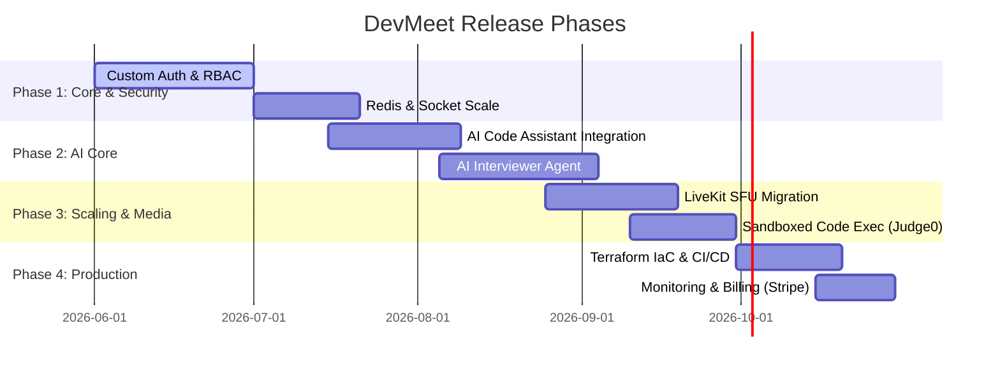
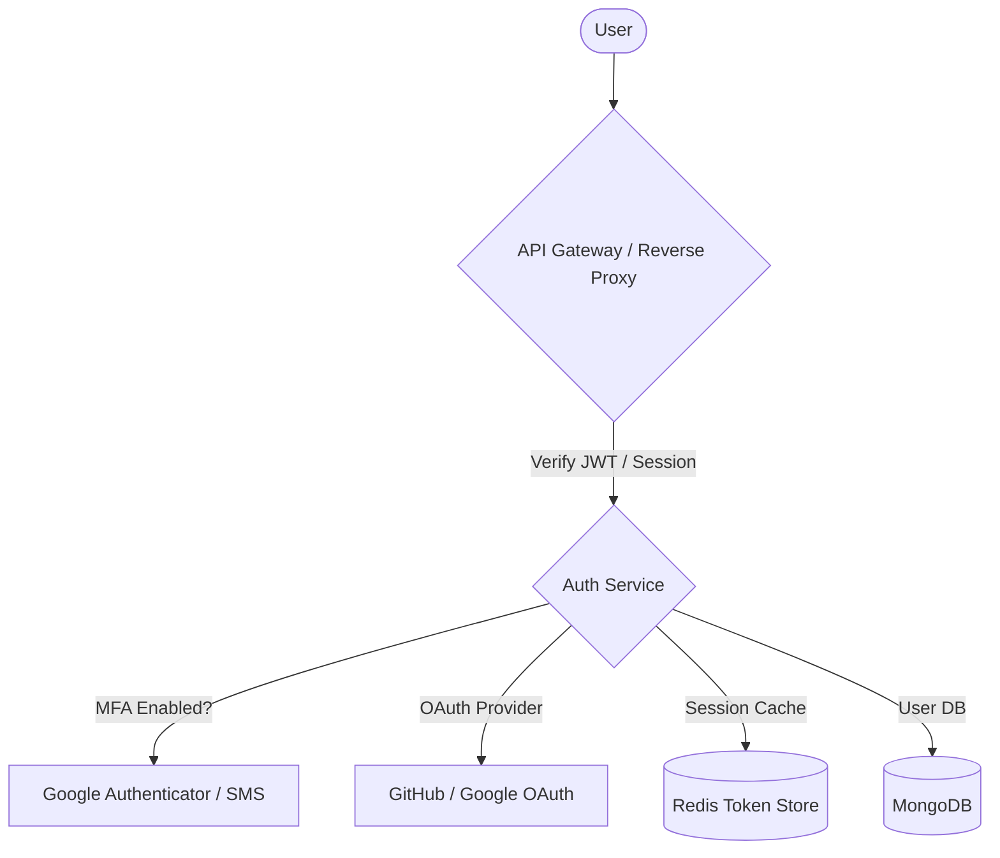
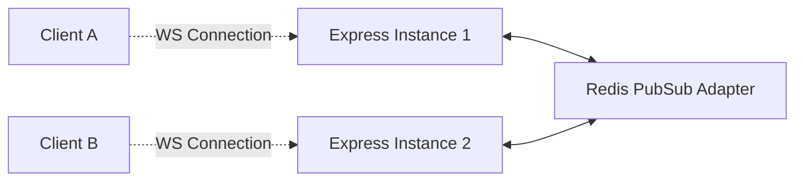
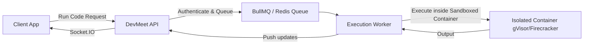

# DevMeet: Professional Product Roadmap

This document outlines the end-to-end strategic and technical roadmap to transition **DevMeet** from a collaborative workspace prototype into a high-scale, production-ready SaaS product capable of competing with platforms like Zoom, LiveKit, and specialized coding arenas like CoderPad and Cursor.

---

## 🗺️ Execution Timeline & Phases

---

## 🧠 1. AI Integration & Competitive Edge (Agentic Capabilities)

To stand out in the current market, DevMeet must move beyond simple collaboration and introduce **agentic intelligence**.

### A. Live AI Pair Programmer (Monaco Integration)
* **What it does:** In-editor AI assistant (similar to Copilot/Cursor) sharing context of the entire room's workspace.
* **Architecture:**
  * Backend proxies prompts to Anthropic Claude or OpenAI GPT-4o via stream APIs.
  * Monaco editor handles inline suggestions (via `registerCompletionItemProvider`) and inline code-generation widgets (via custom decorations).
  * Room context (open files, terminal output, current language) is appended to the prompt.

### B. AI Technical Interviewer Agent (Voice & Code)
* **What it does:** A real-time AI participant in the room that can act as a technical interviewer or coding assistant.
* **Architecture:**
  * **Audio/Video Stream:** The AI connects to the room's WebRTC session (via LiveKit's Node.js SDK) as an active audio/video participant.
  * **Real-time Voice Synthesis:** Using OpenAI Realtime API or Deepgram (Speech-to-Text) + ElevenLabs (Text-to-Speech) for low-latency voice feedback.
  * **Dynamic Assessment:** The agent reviews changes in the Monaco Editor and asks questions aloud (e.g., *"I see you're using a nested loop there. Can you tell me what the time complexity is and how we can optimize it?"*).

### C. AI Collaborative Whiteboard & Diagrammer
* **What it does:** Generates architectural diagrams from text and enables multi-user editing.
* **Architecture:**
  * Integrate **Excalidraw** or **tldraw** as the collaborative whiteboard.
  * Add an LLM wrapper that parses descriptions (e.g., *"Draw a load-balanced 3-tier architecture with Redis cache"*) and generates the corresponding Excalidraw JSON structure.

---

## 🔒 2. Enterprise-Grade Authentication & Security

A product used by enterprise teams and developers must meet strict security standards.

* **Authentication Architecture:**
  * **JWT + HttpOnly Cookies:** JWT tokens split into a short-lived `AccessToken` and a secure, `httpOnly`, `Secure`, `SameSite=Strict` `RefreshToken` stored in the user's browser.
  * **OAuth 2.0:** Single Sign-On (SSO) using GitHub and Google OAuth.
  * **Multi-Factor Authentication (MFA):** TOTP (Google Authenticator) and WebAuthn (Passkeys/Biometrics) support.
* **Access Control:**
  * Implement strict **RBAC** (Role-Based Access Control) with workspace-level permissions (`Viewer`, `Collaborator`, `Interviewer`, `Admin`).
  * Room tokenization: Generation of secure cryptographic access signatures (e.g., HMAC-SHA256) matching user profiles, preventing unauthorized room access ("Zoom-bombing").

---

## ⚡ 3. Real-Time Infrastructure Scaling & Load Handling

DevMeet uses WebSockets (Socket.IO) and WebRTC for low-latency interactions. Scaling these requires distinct architectural shifts:

### A. Scaling WebSockets (Socket.IO)
To handle tens of thousands of concurrent users, Socket.IO must scale horizontally across multiple node processes/containers:

* **Redis Adapter:** Integrate `@socket.io/redis-adapter`. This broadcasts messages across all servers, ensuring that a user connected to Server A receives state updates from a user connected to Server B in the same room.
* **Sticky Sessions:** Configure the Load Balancer (Nginx/AWS ALB) with IP-based sticky sessions, which is required during the initial HTTP handshake phase of Socket.IO.

### B. High-Scale Video/Audio: WebRTC to LiveKit SFU
* **The Problem:** Peer-to-Peer (Mesh) WebRTC scales quadratically ($O(N^2)$ connections). If a room has 5 users, each user must send 4 streams and receive 4 streams, crushing browser CPU and bandwidth.
* **The Solution:** Migrate to **LiveKit** (an open-source WebRTC Selective Forwarding Unit or SFU).
  * In an SFU architecture, each client uploads only **1 stream** to the server, and the server distributes it to the other clients.
  * LiveKit handles dynamic bandwidth adaptation, simulcast (high/medium/low quality streams), and easily scales to hundreds of participants per room.

---

## 💻 4. Secure & Scale Code Execution (Judge0 Integration)

Running untrusted code submitted by users is a severe security risk and resource bottleneck.

* **Sandboxing:** Do NOT run code on your primary API servers. Deploy isolated, stateless execution microservices using **Judge0** or a custom **gVisor/Firecracker** cluster.
* **Resource Limits:** Enforce strict limits on execution requests:
  * **Timeout:** Maximum 5 seconds CPU time.
  * **Memory:** Maximum 128MB RAM per execution.
  * **Network:** Disable outbound internet access inside the sandbox to prevent DDOS redirection or mining.
* **Job Queues:** Use **BullMQ** (powered by Redis) on the Express backend to queue run requests, preventing spikes in code compilation from crashing the API gateway.

---

## 🏗️ 5. Deployment & Production Infrastructure

Deploying to production requires a solid Infrastructure-as-Code (IaC) and deployment strategy.

### A. Multi-Service Cloud Architecture (AWS/GCP)
* **Domain Structure:**
  * Landing site: `devmeet.com` (Static Vercel deployment with global CDN cache).
  * Client app: `app.devmeet.com` (Vercel or AWS ECS Fargate).
  * API backend: `api.devmeet.com` (AWS ECS Fargate with Auto Scaling).
  * Media server: `media.devmeet.com` (AWS EC2 instances running LiveKit SFU with low-latency network optimization).
* **IaC:** Manage database provisioning (MongoDB Atlas), Redis caches (AWS ElastiCache), and server clusters using **Terraform**.

### B. CI/CD Pipeline
* **GitHub Actions:**
  * **Step 1:** Run static checks (ESLint, Prettier, TypeScript compilation checks).
  * **Step 2:** Run Vitest unit tests.
  * **Step 3:** Spin up a temporary Docker-compose stack to execute Playwright integration tests.
  * **Step 4:** Build production-optimized Docker images and push to AWS ECR.
  * **Step 5:** Perform rolling updates on ECS Fargate.

---

## 📈 6. Observability, Performance & Monetization

### A. Observability & Monitoring
* **Error Tracking:** Integrate **Sentry** across frontend, landing-page, and backend to aggregate stack traces and alert on regressions.
* **Log Aggregation:** Use **Winston** (backend) logging to stream structured JSON logs to **Loki/Grafana** or **Datadog**.
* **Metrics:** Collect CPU/RAM usage, active WebSockets, active media tracks, and MongoDB queries using **Prometheus**.

### B. Monetization (Stripe Billing Integration)
* **Freemium Tier:** Free rooms with 1-to-1 video calling and standard Monaco editor.
* **Pro Tier ($15/mo):** Multi-party video calling (SFU), unlimited AI code completion, and sandboxed code execution up to 500 runs/mo.
* **Enterprise Tier (Custom):** Dedicated SSO/SAML auth, private sandboxes, audit logs, and custom AI interviewer models.
* **Billing System:** Use **Stripe Billing** with webhook handlers on the backend to automatically toggle account states in MongoDB.
