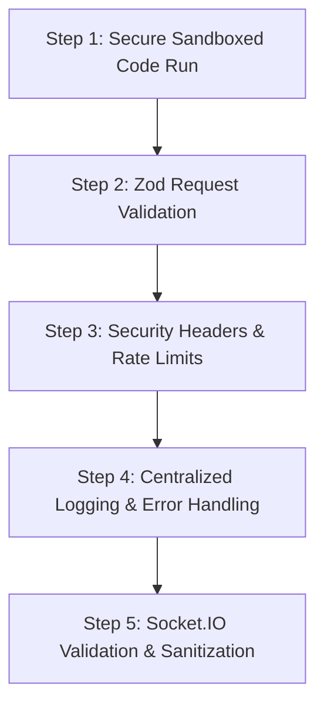

# DevMeet: Security & Robustness Implementation Plan

Before introducing AI agents or scaling up, the underlying application must be secure, resilient, and production-hardened. This plan details the vulnerabilities in the current codebase and specifies how we will fix them to achieve enterprise-grade security and robustness.

---

## 🔍 Current State Analysis

### What is Completed (Current Baseline):
* **Workspace Split:** The repo is cleanly divided into a Marketing Landing Page, a Client Dashboard App, and an Express Backend.
* **Basic Auth:** Custom JWT Authentication using Cookie-based tokens.
* **Room Management:** Room creation, joining, history tracking, and deletion.
* **Real-time Sync:** Socket.IO handles presence, code editor syncing, file tree syncing, and simple chat.
* **WebRTC Signaling:** Socket event forwarding for Peer-to-Peer video calls.

### ⚠️ Critical Security & Robustness Gaps:
1. **RCE Vulnerability in Code Execution:** In `room.controller.ts`, the `runCode` function writes code files locally and runs them via native shell commands using `exec()`. Any client can run malicious shell code to read server env secrets, modify the filesystem, or crash the host machine.
2. **Missing Request Validation:** Controllers manually check if fields are empty (`field?.trim() === ""`). There is no strict schema check for emails, password strength, username patterns, or file structures, making it easy to cause database query validation crashes.
3. **No Rate Limiting:** There is no protection on `/api/v1/users/login`, `/register`, or `/rooms/run-code`. A user can spam these endpoints, causing brute-force entry or Denial of Service (DoS) due to high CPU code runs.
4. **Exposed Stack Traces:** The global error handler doesn't strip stack traces in production, which leaks server configuration details to API consumers.
5. **No WebSocket Input Validation:** The server processes Socket.IO events (like `code-change`, `files-change`, and `send-message`) directly without checking payload shapes, meaning a corrupted socket request can throw unhandled exceptions and crash the entire node server.

---

## 🛠️ Step-by-Step Robustness Roadmap



---

### Step 1: Secure Sandboxed Code Execution
We will replace the unsafe `child_process.exec` in [room.controller.ts](file:///c:/Users/siddh/OneDrive/Documents/Desktop/Devmeet2/backend/src/controllers/room.controller.ts) with one of the following two options depending on your preference.

#### Option A: Dockerized Sandbox (Local/Self-Hosted Cloud)
We run the user code inside a temporary Docker container with memory/CPU limits and disabled networking:
* **Implementation details:**
  * Define a minimalist execution Docker image (e.g. Alpine-based with Node/Python/TSX pre-installed).
  * Spawn the container dynamically with restrictive flags:
    ```bash
    docker run --rm -v "temp_file_dir:/app" --network none --memory 128m --cpus 0.5 execution-image node /app/usercode.js
    ```
  * Enforce standard timeout (e.g., 5s max) inside the container.

#### Option B: Third-Party API Integration (Piston/Judge0) (Recommended)
Integrate an instance of **Piston** (open source by EngineerMan) or **Judge0**.
* **Implementation details:**
  * Post payload directly to the running Piston execution API endpoint. Piston handles safe compilation, outputs stderr/stdout, and executes everything in a highly secure gVisor-based environment.

---

### Step 2: Robust Input Validation using Zod
We will introduce `zod` schema middleware to validate API payloads before they hit the controller.

1. **New Middleware File:** [validation.middleware.ts](file:///c:/Users/siddh/OneDrive/Documents/Desktop/Devmeet2/backend/src/middlewares/validation.middleware.ts)
   ```typescript
   import { Request, Response, NextFunction } from "express";
   import { AnyZodObject, ZodError } from "zod";
   import { ApiError } from "../utils/ApiError.js";

   export const validateRequest = (schema: AnyZodObject) => 
     (req: Request, res: Response, next: NextFunction) => {
       try {
         schema.parse({
           body: req.body,
           query: req.query,
           params: req.params,
         });
         next();
       } catch (error) {
         if (error instanceof ZodError) {
           const errors = error.errors.map(err => `${err.path.join('.')}: ${err.message}`);
           next(new ApiError(400, "Validation failed", errors));
         } else {
           next(error);
         }
       }
     };
   ```

2. **Validation Schemas:** [auth.schema.ts](file:///c:/Users/siddh/OneDrive/Documents/Desktop/Devmeet2/backend/src/schemas/auth.schema.ts)
   * Enforce correct email format, username regex rules (alphanumeric only), and minimum password lengths (e.g., 8+ characters).

---

### Step 3: Security Headers, CORS, and Rate Limiting
1. **Security Headers (`helmet`):** Add `helmet()` to secure HTTP headers, disabling signatures (`X-Powered-By`) and enforcing content security policies.
2. **CORS Lockdown:** Strict origin checks to ensure only valid URLs (e.g., your staging or production client URLs) can access the API.
3. **NoSQL Injection Guard:** Add `express-mongo-sanitize` to strip `$` and `.` characters from request objects, blocking MongoDB query injection payloads.
4. **Rate Limiting:** Protect route clusters:
   * **Auth Rate Limiter:** Max 10 requests per 15 minutes for `/api/v1/users/register` and `/login`.
   * **Code Execution Rate Limiter:** Max 30 requests per minute per IP for `/api/v1/rooms/run-code`.

---

### Step 4: Centralized Error Handling & Logging
1. **Production logging:** Integrate **Winston** to write logs into files (`combined.log` and `error.log`) with structured timestamps instead of raw `console.log`.
2. **Error formatting:** Edit the global error handler in [app.ts](file:///c:/Users/siddh/OneDrive/Documents/Desktop/Devmeet2/backend/app.ts) to:
   * Hide detail stack traces if `process.env.NODE_ENV === "production"`.
   * Standardize error responses (success status, HTTP code, clean error arrays).

---

### Step 5: WebSocket Input Validation & Hardening
In [index.ts](file:///c:/Users/siddh/OneDrive/Documents/Desktop/Devmeet2/backend/index.ts), wrap socket event inputs in Zod schema verification:
* Validate the structure of `join-room` payload (`roomId` must be 6 alphanumeric characters).
* Limit the size of `code-change` payloads (e.g. reject if code is larger than 1MB).
* Wrap MongoDB operations in safe `try/catch` blocks inside socket handlers to prevent unhandled database promise rejections from crashing the WebSocket thread.

---

## 📈 Verification Plan

### Automated Tests
* Write unit tests for the Zod validators to ensure empty or malformed inputs are correctly blocked (400 Bad Request).
* Write integration tests simulating malicious payloads (e.g., shell command injections in run-code parameters) to confirm they are blocked or safely executed in the sandbox.

### Manual Verification
* Trigger a script execution that runs an infinite loop (e.g., `while(true) {}`) and verify the sandbox correctly limits execution resources and exits cleanly (timeout) without freezing the backend process.
* Run a load-testing script (like autocannon) against `/login` and verify that the rate limiter returns `429 Too Many Requests` after exceeding thresholds.
