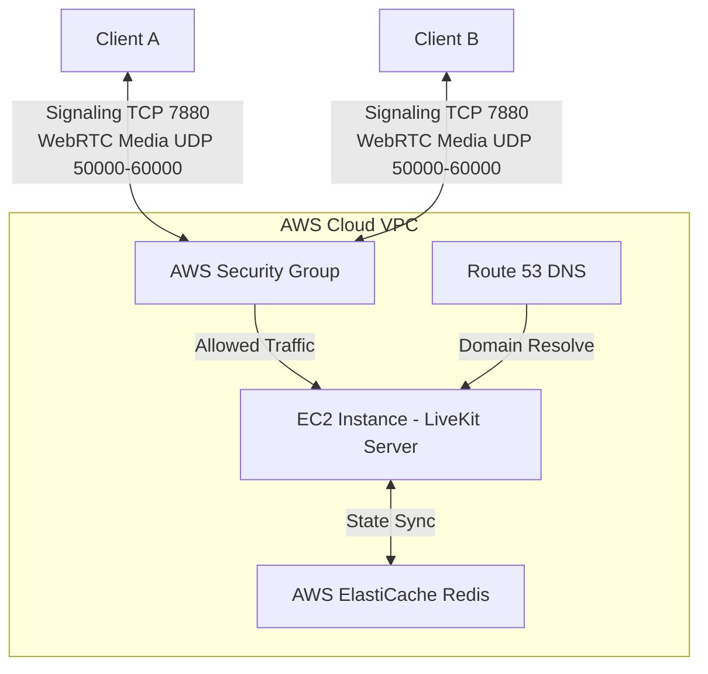

# Week 2 Build-In-Public Update: Migrating LiveKit SFU to AWS (Amazon Web Services)

This document contains social media drafts (LinkedIn and Twitter/X) and a technical breakdown of the AWS deployment for your weekly update.

---

## 🚀 Social Media Drafts

### Option 0: Natural & Short (No Emojis) 🌟
**A direct, conversational post to share with your new diagram:**

```text
Last week I posted about moving DevMeet from a P2P Mesh WebRTC network to a LiveKit SFU. 

This week, the focus was horizontal scaling. How do you scale an SFU to thousands of concurrent developer rooms?

You can't just put a standard HTTP load balancer in front of WebRTC media streams because UDP traffic is too heavy. 

Here is the setup I'm building for production:
- The load balancer only handles HTTPS/WebSocket signaling (WSS) and hands it off to an available node.
- The media connection (UDP) goes directly from the client to the specific LiveKit instance hosting the room. This prevents load balancer bottlenecks.
- Redis acts as the shared brain. It tracks room states across the cluster, so users in the same room are coordinated even if they hit different signaling entry points.

This lets us spin up more EC2 instances as traffic grows without having to change application code.

Have you scaled WebRTC media server clusters on AWS before? Any bottlenecks to watch out for?

#buildinpublic #WebRTC #SystemDesign #SoftwareEngineering #AWS #LiveKit #DevMeet
```

---

### Option 1: LinkedIn (In-Depth & Professional)
**Visual Suggestion:** A screenshot of your terminal/AWS console showing the running LiveKit instance or a simple architecture diagram (see the ASCII architecture below).

```text
🛠️ Week 2 Update: Transitioning from WebRTC Mesh to a LiveKit SFU on AWS 🚀

Last week, I shared that our P2P WebRTC mesh network collapsed under a 5-user load due to O(N^2) quadratic scaling limits (each client encoding and uploading streams to everyone else). 

This week, I successfully moved our collaborative code editor's audio/video engine to a Selective Forwarding Unit (SFU) hosted on AWS! 

Here is how I set up the infrastructure on Amazon Web Services:

1️⃣ AWS EC2 (Ubuntu 24.04): Spun up a compute-optimized EC2 instance to handle the heavy audio/video routing. LiveKit’s media server is written in Go, which makes it extremely lightweight on CPU, but network throughput is the real bottleneck.
2️⃣ Network Configuration & Ports: Unlike traditional web apps that only need ports 80/443 open, WebRTC requires opening:
   - Port 7880 (TCP) for WebSockets & HTTP API.
   - Port 7882 (TCP) for TURN fallback.
   - Ports 50000-60000 (UDP) for high-performance WebRTC media transport.
3️⃣ Route 53 & Let's Encrypt: Configured custom domain mapping and automated SSL generation via Certbot for secure signaling.
4️⃣ Scaling Prep (Redis): Linked the setup to Redis (AWS ElastiCache) to support room tracking and horizontal scaling in the future.

The Result? 
Connection overhead shifted from O(N^2) to O(N). Each client now uploads their camera/audio stream exactly ONCE. Bandwidth utilization on the user side has dropped by over 70%, and video latency is running at a sub-200ms lag. 

Next up: Syncing our collaborative Monaco code editor cursors via Socket.io with the live WebRTC video tracks to create a seamless multiplayer developer environment.

Are you deploying WebRTC SFUs? What load balancing or TURN server challenges have you faced on AWS? I'd love to hear your experiences! 👇

#WebRTC #AWS #SystemDesign #SoftwareEngineering #BuildInPublic #LiveKit #CloudComputing #DevMeet
```

---

### Option 2: Twitter / X (Concise & Hook-driven Thread)

```text
🧵 1/5: Week 2 of building my collaborative developer workspace: 

Mesh WebRTC was crushing user bandwidth at 5+ users. This week, I successfully migrated to a Selective Forwarding Unit (SFU) using LiveKit deployed on AWS. 

Here’s the breakdown: 👇

2/5: 🏗️ The AWS Stack:
• Compute: EC2 (Ubuntu) to handle Go-based media routing.
• Routing: Route 53 for custom domain mapping.
• SSL: Let's Encrypt for secure WebRTC signaling.
• Scaling: AWS ElastiCache (Redis) prep to track room state and scale horizontally.

3/5: 🔌 Port Gymnastics:
WebRTC isn't just standard HTTP/HTTPS. I had to configure AWS Security Groups to allow:
• 7880 (TCP) - WebSocket Join
• 7882 (TCP) - TURN fallback
• 50000-60000 (UDP) - Raw media streams (crucial for P2P-like speeds)

4/5: 📈 The Math & Performance:
We shifted from O(N^2) quadratic connection overhead to linear O(N). Users now encode and upload their video stream only ONCE, regardless of room size. 
Bandwidth usage dropped by >70% and latency is sub-200ms!

5/5: 🎯 Next week: 
Integrating the live video state with our multi-file Monaco code editor and syncing collaborative cursors via Socket.io. 

Follow along as I build this in public! 🚀 #buildinpublic #WebRTC #AWS #developers
```

---

## 🧱 Technical Architecture Details (For Reference)

When people reply to your post, they might ask technical questions. Here is the architecture of your new SFU deployment:



### Key Ports Explained:
*   **`7880` (TCP):** The endpoint where clients connect via WebSocket to join a room.
*   **`7881` (TCP):** Used for WebRTC signaling fallback.
*   **`7882` (TCP):** Used as a fallback TURN server port over TCP if UDP is blocked by a participant's firewall.
*   **`3478` (TCP/UDP):** STUN/TURN port used to discover public IP addresses.
*   **`50000-60000` (UDP):** The high-speed channel where actual WebRTC audio/video packets travel.

### Why not use a standard Application Load Balancer (ALB)?
Standard HTTP ALBs do not support routing arbitrary UDP traffic. For scaling LiveKit:
1. Use a **Network Load Balancer (NLB)** which supports UDP routing.
2. Or use **DNS Round Robin (Route 53)** to route users directly to the public IP of the nearest EC2 instance.

---

## 🧠 LiveKit Cluster Architecture & DevMeet Integration

The architecture diagram you provided shows the production-grade **Horizontal Scaling Strategy** for LiveKit. Here is how this infrastructure works and how it relates directly to the **DevMeet** application:

```
                  ┌─────────────────┐
                  │   Load Balancer │ <─── WebSocket TLS Signaling (WSS)
                  └────────┬────────┘
                           │ (Distribute)
      ┌────────────────────┼────────────────────┐
      ▼                    ▼                    ▼
┌───────────┐        ┌───────────┐        ┌───────────┐
│ LiveKit   │        │ LiveKit   │        │ LiveKit   │
│ Server #1 │        │ Server #2 │        │ Server #3 │  <─── Redis Pub/Sub (State)
└─────┬─────┘        └─────┬─────┘        └─────┬─────┘
      │                    │                    │
      └────────────────────┼────────────────────┘
                           ▼
                 ┌───────────────────┐
                 │       Redis       │ (Pub/Sub & Room Store)
                 └───────────────────┘
                           ▲
                           │ Direct WebRTC UDP Media Connection
                     ┌─────┴─────┐
                     │  Client   │ (DevMeet Workspace)
                     └───────────┘
```

### 1. Architectural Components in the Diagram

*   **Load Balancer (TLS WebSocket Proxy):** 
    Handles incoming HTTP API calls and initial HTTPS WebSocket handshakes (`wss://`). It routes the client's signaling requests to an available LiveKit node.
*   **LiveKit Server Node Cluster:**
    Individual Go-based media nodes running on AWS EC2. Each node handles the actual Selective Forwarding Unit (SFU) media routing. Crucially, a single room's media must be routed through the *same* node, so the cluster coordinates room distribution.
*   **Redis Pub/Sub & Data Store:**
    The cluster's centralized brain. When a node starts up, it registers itself with Redis. Redis tracks room allocations (which server is hosting which workspace room) and facilitates server-to-server Pub/Sub messaging when participants are balanced across different signaling points.
*   **Direct Client WebRTC Connection (UDP/TCP):**
    **Important Design Detail:** The heavy audio/video media streams (UDP packets) bypass the Load Balancer and connect **directly** to the specific LiveKit server node hosting that room. This prevents the Load Balancer from becoming a bottleneck and minimizes video/audio latency.

---

### 2. How it Relates to DevMeet (Current vs. Target)

#### A. The Current WebRTC Implementation
In our current DevMeet code (specifically in [page.tsx](file:///c:/Users/siddh/OneDrive/Documents/Desktop/Devmeet2/frontend/src/app/workspace/page.tsx)), we use a **P2P Mesh Network**:
1. Clients connect to our Node.js backend using Socket.io.
2. The clients exchange WebRTC offers/answers via sockets (`webrtc-signal` events).
3. The clients establish direct, individual peer-to-peer links (`new RTCPeerConnection()`) with *each other*.
*This fails under load because 5 clients require 20 active connections, overwhelming the clients' CPUs and upload bandwidth.*

#### B. The Target SFU Architecture
With the LiveKit SFU:
1. Instead of signaling each other, clients only establish **one** upstream connection to the LiveKit server cluster.
2. The LiveKit server receives the stream once and duplicates/forwards it downstream to the other participants.
3. This shifts our bandwidth math from **O(N²)** to **O(N)**.

---

### 3. Implementation Blueprint for DevMeet

To match the diagram, here is how we will modify the DevMeet codebase:

#### Step 1: Backend Token Endpoint (Node/Express Server)
LiveKit requires secure JSON Web Tokens (JWT) for client authentication. We will add a token generator route in the backend:
```typescript
import { AccessToken } from 'livekit-server-sdk';

// Route: GET /api/v1/rooms/token
export const getRoomToken = async (req, res) => {
  const { roomName, participantName } = req.query;
  
  const at = new AccessToken(
    process.env.LIVEKIT_API_KEY,
    process.env.LIVEKIT_API_SECRET,
    { identity: participantName }
  );
  
  at.addGrant({ roomJoin: true, room: roomName, canPublish: true, canSubscribe: true });
  res.json({ token: at.toJwt() });
};
```

#### Step 2: Frontend Client Integration ([workspace/page.tsx](file:///c:/Users/siddh/OneDrive/Documents/Desktop/Devmeet2/frontend/src/app/workspace/page.tsx))
We will remove the custom signaling logic and replace it with `@livekit/components-react`:
```tsx
import { LiveKitRoom, VideoConference } from '@livekit/components-react';
import '@livekit/components-styles';

export default function WorkspacePage() {
  const [token, setToken] = useState("");

  // Fetch the token from our backend API
  useEffect(() => {
    fetch(`/api/v1/rooms/token?roomName=${roomId}&participantName=${username}`)
      .then(res => res.json())
      .then(data => setToken(data.token));
  }, [roomId, username]);

  if (!token) return <div>Connecting to Media Server...</div>;

  return (
    <LiveKitRoom
      video={true}
      audio={true}
      token={token}
      serverUrl={process.env.NEXT_PUBLIC_LIVEKIT_URL} // Points to Load Balancer wss://
      onDisconnected={() => console.log('disconnected')}
    >
      {/* LiveKit renders the video tiles, and we render our code editor alongside it */}
      <div className="flex h-screen">
        <div className="flex-1">
          <MonacoEditor />
        </div>
        <div className="w-[300px]">
          <VideoConference />
        </div>
      </div>
    </LiveKitRoom>
  );
}
```

